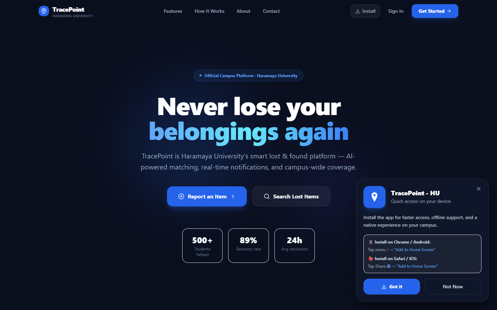
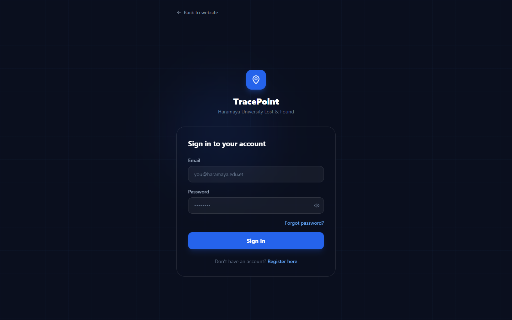
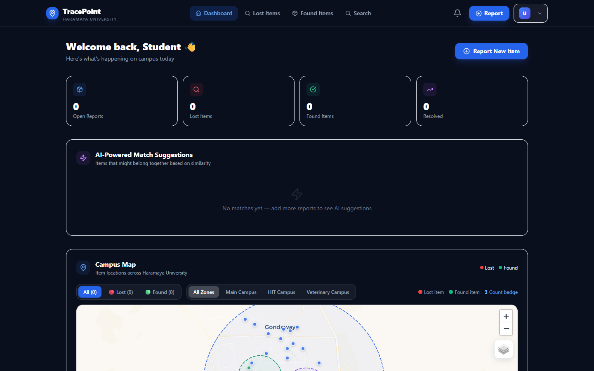
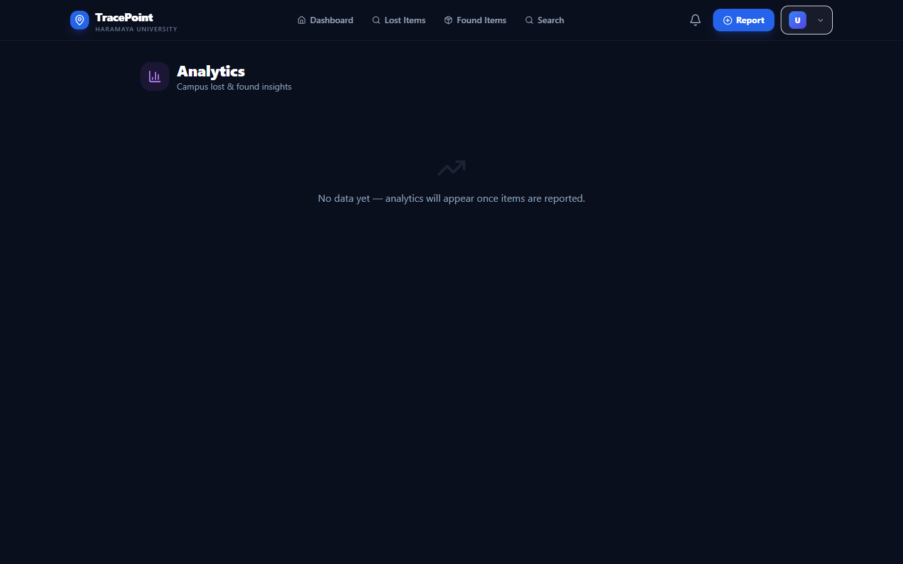
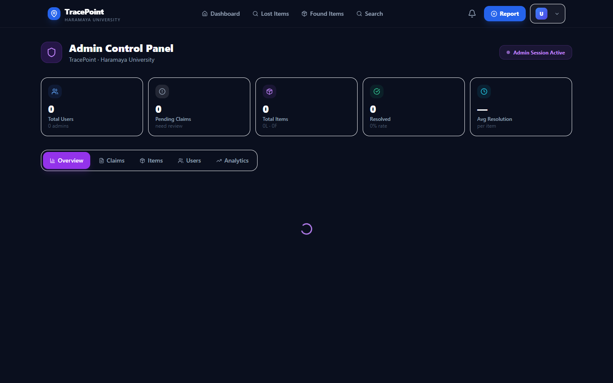
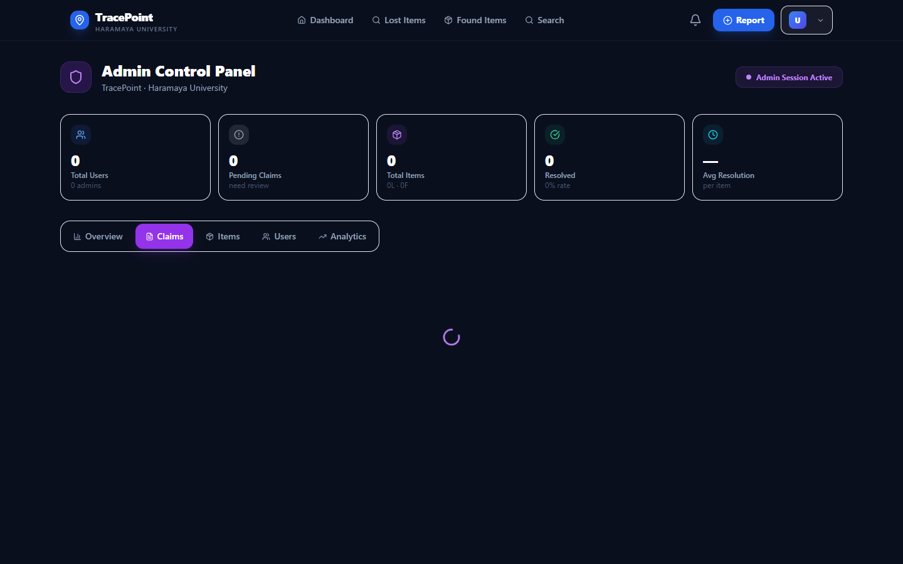

<div align="center">

# 🔍 TracePoint
### Smart Lost & Found Platform — Haramaya University

[](https://tracepoint-system.web.app)
[](https://reactjs.org)
[](https://firebase.google.com)
[](https://tracepoint-system.web.app)

*A production-grade campus lost & found ecosystem connecting students, staff, and administrators in real time.*

</div>

---

## ✨ Features

### 👨‍🎓 For Students
| Feature | Description |
|---|---|
| 📋 **Report Items** | Report lost or found items with photo, campus location & description |
| 🔍 **Search & Filter** | Browse by category, location, keyword, or status |
| 🧠 **AI Matching** | Automatic similarity scoring between lost & found reports |
| ✅ **Claim System** | Submit proof of ownership — admin verified |
| 🔔 **Real-time Alerts** | Instant notifications for matches, claims & updates |
| 🗺️ **Campus Map** | Interactive Haramaya University map with real building locations |
| 🕒 **Item Timeline** | Full activity history from report to resolution |
| 📲 **PWA** | Install as native app — works offline |

### 🛡️ For Admins
| Feature | Description |
|---|---|
| 📊 **Analytics Dashboard** | Recovery rates, hot zones, category trends, 7-day activity |
| ✅ **Claims Review** | Approve or reject ownership claims with one click |
| 👥 **User Management** | Promote/demote users, view all accounts |
| 📦 **Item Moderation** | View, manage and delete any report |
| 🚨 **Duplicate Detection** | Automatic flagging of similar reports |
| ⚡ **Purple Admin Theme** | Separate admin experience from student dashboard |

---

## 📸 Screenshots

| | |
|---|---|
| **Landing Page** | **Login** |
|  |  |
| **Student Dashboard** | **Analytics** |
|  |  |
| **Admin Overview** | **Admin Claims** |
|  |  |

---

## 🛠️ Tech Stack

| Layer | Technology |
|---|---|
| **Frontend** | React 18, React Router v6, Tailwind CSS v3 |
| **Backend** | Firebase Firestore (real-time), Firebase Auth |
| **Images** | Cloudinary (free tier, unsigned upload) |
| **Map** | Leaflet.js + OpenStreetMap/Esri Satellite |
| **Charts** | Recharts (bar, line, pie, heatmap) |
| **PWA** | Service Worker, Web App Manifest |
| **Hosting** | Firebase Hosting |
| **Icons** | Lucide React |

---

## 🚀 Getting Started

### 1. Clone
```bash
git clone https://github.com/gemachistesfaye/tracepoint-system.git
cd tracepoint-system
```

### 2. Install
```bash
npm install
```

### 3. Environment
```bash
cp .env.example .env
# Fill in your Firebase and Cloudinary credentials
```

### 4. Run
```bash
npm start
```

---

## 🔐 Firebase Setup

Enable in [Firebase Console](https://console.firebase.google.com/project/tracepoint-system):
- **Authentication** → Email/Password
- **Firestore Database** → Start in test mode
- No Storage needed (uses Cloudinary)

### Firestore Security Rules
```javascript
rules_version = '2';
service cloud.firestore {
  match /databases/{database}/documents {
    match /items/{itemId} {
      allow read: if true;
      allow create: if request.auth != null;
      allow update, delete: if request.auth != null &&
        (request.auth.uid == resource.data.reportedBy ||
         get(/databases/$(database)/documents/users/$(request.auth.uid)).data.role == 'admin');
    }
    match /claims/{claimId} {
      allow read, create: if request.auth != null;
      allow update: if request.auth != null &&
        get(/databases/$(database)/documents/users/$(request.auth.uid)).data.role == 'admin';
    }
    match /users/{userId} {
      allow read: if request.auth != null;
      allow write: if request.auth != null &&
        (request.auth.uid == userId ||
         get(/databases/$(database)/documents/users/$(request.auth.uid)).data.role == 'admin');
    }
    match /notifications/{notifId} {
      allow read, write: if request.auth != null;
    }
  }
}
```

---

## 🖼️ Cloudinary Setup

1. Create free account at [cloudinary.com](https://cloudinary.com)
2. Dashboard → Settings → Upload → **Add unsigned preset**
3. Add to `.env`:
```
REACT_APP_CLOUDINARY_CLOUD_NAME=your_cloud_name
REACT_APP_CLOUDINARY_UPLOAD_PRESET=your_preset
```

---

## 👑 First Admin

After registering on the site:
1. Go to **Firestore** → `users` collection → your document
2. Edit `role` field → set to `"admin"`
3. Refresh — you'll see the purple Admin Panel

---

## 📦 Deploy

```bash
npm run build
firebase deploy --only hosting
```

Live at → **[https://tracepoint-system.web.app](https://tracepoint-system.web.app)**

---

## 📁 Project Structure

```
src/
├── components/
│   ├── analytics/     # Charts & heatmap
│   ├── claims/        # Claim modal
│   ├── common/        # Navbar, PWA, Notifications
│   ├── items/         # Item cards & report form
│   └── map/           # Leaflet campus map
├── context/           # Auth & Items global state
├── firebase/          # Firestore, Auth, Cloudinary
├── pages/             # All page components
└── utils/             # Helpers, AI matching engine
```

---

<div align="center">

Built with ❤️ for **Haramaya University** — Oromia, Ethiopia

**[Live Site](https://tracepoint-system.web.app)** · **[Report Bug](https://github.com/gemachistesfaye/tracepoint-system/issues)**

</div>
